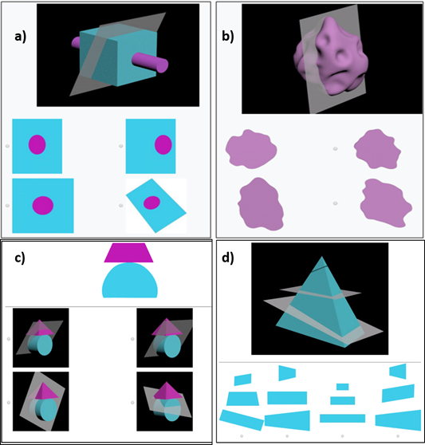

Other Projects
=========

Developing 3D Spatial Ability Test Instrument
-------
Results from our in-depth formative studies suggest that experts have a stronger mental model of the 3D structures they segment compared to novices. To validate this assumption, we introduce a novel test instrument to explore experts’ mental model in the context of 3D image segmentation. Our test instrcument is a more complex modified version of [Santa Barbara Solids Test (SBS)](https://labs.psych.ucsb.edu/hegarty/mary/publications/110).
We use this test instrument to measure individual differences in various spatial segmentation and visualization tasks. The tasks involve identifying valid 2D contours, slicing planes and 3D shapes.

 

Note: See [this video Tutorial](https://www.youtube.com/watch?v=S4RgqArzTI0) to get better understanding of 2D cross-section of 3D structures.

Visualizing Social Network Analysis (SNA) Metrics for Open Source Projects
-------
In this project, I designed and implemented an effective visualization to display SNA metrics for different open source projects during 18 months of forking period. The goal of the visualization was to help software developers and project managers observe and track the changes in metrics and trends during the forking period as part of their analysis for evaluating and predicting the open source project evolution.

Note: Feel free to see the <a href="index_visulization.html" title="Vis Project">project website</a>. The full description of the project can be found <a href="ASanandaji_Research_Statement.pdf" title="Vis Project">here</a>. 

 

Intelligent Model for Traffic Flow Prediction
-------
In this project, I used machine learning techniques to develop a novel real time prediction model for ramp metering. I designed and developed a smart algorithm that utilizes historical traffic data, as well as traffic measures such as speed, current traffic volume, and breakdown capacity to control ramp signal based on the current and predicted traffic flow.

Machine Learning and Intelligent Agents
-------
In this project, I designed an intelligent agent based on reinforcement learning to learn game strategies. The intelligent player was a modified version of the Line Runner game developed for Android and iOS. In my game, the agent learns to jump/roll to pass obstacles and collect coins to maximize the reward. I implemented the Intelligent agent in MATLAB and used Visual Basic for Applications (VBA) for visualizations, user interface, and animation.

