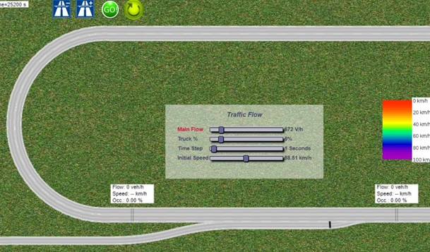

Sample Work and Projects
============
3D Image Segmentation
-------

**Analyzing Human Perception and Cognitive Tasks in 3D Image Segmentation:** This is a user experience and interface development research to develop tools and trainings that enable experts and the general public to collaborate in the identification and segmentation of structures within time-varying volumetric data. [Read More…](segment.md)

3D Training Game
-------

**An Interactive Training Game to Enhance 3D Spatial Skills:** In this project I develop and validate a novel domain-agnostic, computer-based training game for enhancing 2D cross-section understanding of complex 3D structures. [Read More…](game.md)

SystemGroup Website
-------

**Building a Better SystemGroup Portal Through UX Practices:** In this project I led the UX process and team for converting SystemGroup Company (largest software engineering company in my Home Country) main portal website into a modern, responsive, and accessible platform.  [Read More…](sg.md)

Online Flipped Classroom
-------

  **Online Flipped Classroom and Learning Management System (LMS) Design During the COVID-19 Pandemic:** I design and implement a novel pedagogy for creating an active learning experience by extending learning beyond the face-to-face classroom. [Read More…](flipLMS.md)

Visualroo
-------

**Visualroo: A Web Application to Retrieve and Visualize Data:** In this project, I created "Visualroo" a client side web application developed in JavaScript used for teaching regression and statistical dependence (correlation). [Read More…](visualroo.md)

Intelligent Ramp Meter
-------

**Intelligent Model for Traffic Flow Prediction:** in this project, I used machine learning techniques to develop a novel real time prediction model for ramp metering. I also was part of the team to create a simulation portal for the project based on UX concepts. [Read More…](ramp.md)

More Projects
-------

**Check more Projects:** Here are some other project to share including the on-going ones. [Read More…](otherProjects.md)

