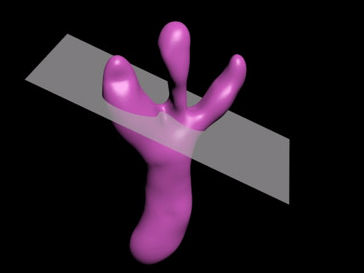
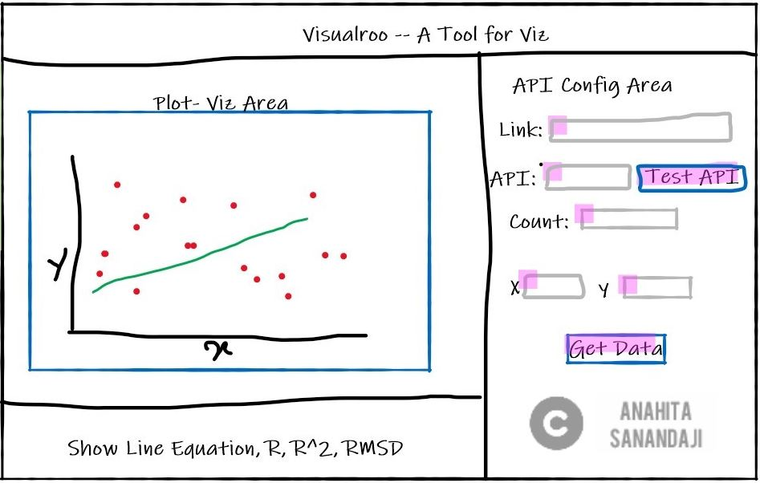

Sample Work and Projects
============

**Analyzing Human Perception and Cognitive Tasks in 3D Image Segmentation:** This is a user experience and interface development research to develop tools and trainings that enable experts and the general public to collaborate in the identification and segmentation of structures within time-varying volumetric data. [Read More…](segment.md)

**An Interactive Training Game to Enhance 3D Spatial Skills:** In this project I develop and validate a novel domain-agnostic, computer-based training game for enhancing 2D cross-section understanding of complex 3D structures. [Read More…](game.md)

  **Online Flipped Classroom and Learning Management System (LMS) Design During the COVID-19 Pandemic:** We design and implement a novel pedagogy for creating an active learning experience by extending learning beyond the face-to-face classroom. [Read More…](flipLMS.md)

**Visualroo: A Web Application to Retrieve and Visualize Data:** In this project, we created "Visualroo" a client side web application developed in JavaScript used for teaching regression and statistical dependence (correlation). [Read More…](visualroo.md)

**Check more Projects:** I have a few more porjects to share.[Read More…](otherProjects.md)

