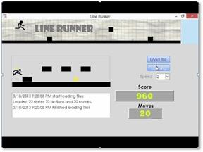

Projects
=========
An Interactive Training Game to Enhance 3D Spatial Skills
-------
**Objective:** Developing and validating a novel domain-agnostic, computer-based training tool for enhancing 2D cross-section understanding of complex 3D structures. 

- Understanding 2D cross-sections of 3D structures is a crucial skill in many disciplines, from geology to medical imaging (e.g., 3D image segmentation). It requires a complex set of spatial/visualization skills including mental rotation, spatial structure understanding, and viewpoint projection. Prior studies show that experts differ from novices in these skills.
- We have developed a novel training tool for inferring 2D cross-sections of 3D structures using a participatory design methodology. We then used a between-subject study design, with 60 participants, to evaluate the training tool. Our primary effectiveness evaluation was based on pre and post spatial tests that measured both cross-section abilities and specific spatial skills: viewpoint, mental rotation, and card rotation.
- Results showed significant performance gains on inferring 2D cross-sections for participants of the training group. Our tool improves two other spatial skills as well: mental rotation and viewpoint visualization. 
We conclude that our training tool was effective not only in enhancing 2D cross-section understanding of complex 3D structures, but also improving mental rotation and viewpoint visualization skills. In addition, it produced a verifiable effect across those skills, utilizing only a small window of training.
- An application of our tool is in medical/research labs to train novice segmenter in ongoing manual 3D volume segmentation tasks. It can also be adapted in other contexts, such as training children, older adults, and individuals with very low spatial skills. 

**Implementation:**
We used Unity/C# for developing the training game. We created 3D models using 3D Studio Max and ZBrush.

 

Note: Project Links
[Training Game Demo](https://youtu.be/ZDS2W_V0pyA ) 
[GitHub](https://github.com/AnahitaS/3DTrainingTool) 

Understanding the Manual 3D Image Segmentation Process
-------
I have had the opportunity to be part of an on-going NSF-funded research with collaborators at the University of North Texas and Washington University in St. Louis. This project focuses on understanding the cognitive and perceptual basis of how experts extract 3D shapes from volumetric data, (e.g., MRI or CT imaging). This process, known as “3D image segmentation” is a fundamental step in many scientific and biomedical applications such as locating tumors. 
My role in this research is to understand human factors involved in segmentation process to make the process more efficient and accurate. In our studies, we designed a novel hybrid protocol that blends observation, interviews, surveys, and eye-tracking, to capture in-depth data. We then developed and validated data coding schemes which could successfully discern segmenters’ low-level perceptual actions, higher-level cognitive tasks, and different segmentation strategies utilized by expert versus novice segmenters to analyze the data captured.

In [this video](https://www.youtube.com/watch?v=u_V85f6edp8) I descirbe my research at OSU Graduate Expo 2016.

 

Note: The project website is accessible at: [VolumeViewer Page](http://volumeviewer.cse.wustl.edu/VolumeViewer/Home.html)

Developing 3D Spatial Ability Test Instrument
-------
Results from our in-depth formative studies suggest that experts have a stronger mental model of the 3D structures they segment compared to novices. To validate this assumption, we introduce a novel test instrument to explore experts’ mental model in the context of 3D image segmentation. Our test instrcument is a more complex modified version of [Santa Barbara Solids Test (SBS)](https://labs.psych.ucsb.edu/hegarty/mary/publications/110).
We use this test instrument to measure individual differences in various spatial segmentation and visualization tasks. The tasks involve identifying valid 2D contours, slicing planes and 3D shapes.

 

Note: See [this video Tutorial](https://www.youtube.com/watch?v=S4RgqArzTI0) to get better understanding of 2D cross-section of 3D structures.

Visualizing Social Network Analysis (SNA) Metrics for Open Source Projects
-------
In this project, I designed and implemented an effective visualization to display SNA metrics for different open source projects during 18 months of forking period. The goal of the visualization was to help software developers and project managers observe and track the changes in metrics and trends during the forking period as part of their analysis for evaluating and predicting the open source project evolution.

Note: Feel free to see the <a href="index_visulization.html" title="Vis Project">project website</a>. The full description of the project can be found <a href="ASanandaji_Research_Statement.pdf" title="Vis Project">here</a>. 

 

Intelligent Model for Traffic Flow Prediction
-------
In this project, I used machine learning techniques to develop a novel real time prediction model for ramp metering. I designed and developed a smart algorithm that utilizes historical traffic data, as well as traffic measures such as speed, current traffic volume, and breakdown capacity to control ramp signal based on the current and predicted traffic flow.

Machine Learning and Intelligent Agents
-------
In this class project, I designed an intelligent agent based on reinforcement learning to learn game strategies. The intelligent player was a modified version of the Line Runner game developed for Android and iOS. In my game, the agent learns to jump/roll to pass obstacles and collect coins to maximize the reward. I implemented the Intelligent agent in MATLAB and used Visual Basic for Applications (VBA) for visualizations, user interface, and animation.

