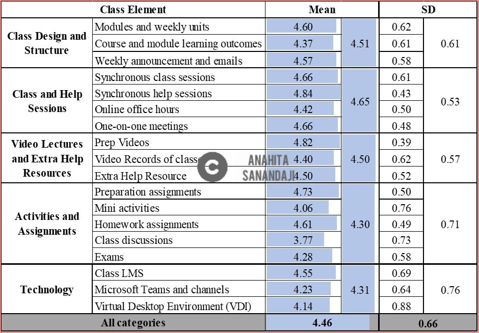

Online Flipped Classroom and Learning Management System (LMS) Design During the COVID-19 Pandemic
=========
##Project Summery
 
####**Challenge:** 
The COVID-19 pandemic caused a sudden switch from face-to-face to online instruction. This has been challenging:

- Building a sense of community and Engagement
- Personal connection between students and the instructor 
- Remaining oriented with course objectives 
- Providing immediate feedback and support 
- Use of the Learning Management System (LMS) 

 

####**Goal**
Design and implementation of a suitable pedagogy for creating an active learning experience by extending learning beyond the face-to-face classroom.

- Using Flipped Class Strategy to lay the basis for a fully online class. 
- Redesigning the Learning Management System LMS to support the Flipped class.

 
####**Application:**
- Design, implement, and evaluate a novel approach to transform face-to-face Information Systems(IS) classes into online flipped instruction.
- This method is not only effective during COVID-19 but is also relevant after this period for any technical IT course.  

 

####**Design & Implementation:**
The proposed framework uniquely combines backward design approach with flipped classroom methodology customized for online education. The framework was successfully applied to the IS courses offered in two colleges in Ohio University during the COVID-19 period. I measured the effectiveness of the online flipped course elements based on the students' feedback and developed design considerations and teaching tips to be used during and after the COVID-19 era.  
 

**Note: Here is the link to my paper: [Manuscript](https://www.tandfonline.com/doi/abs/10.1080/15228053.2021.1901360)**
This work has been published in Journal of Information Technology Case and Application Research.

 
Process
-------
Throughout this project, I ensured the design & implementation process was as user-centered (focusing on students) as possible. This was a long and complex project with lots of background research; here’s a very high-level overview of what the project process looked like.

In the below sections I will focus on the research, class and LMS design and evaluationtion.

 
Research
-------
 
####**Interviews and Guerrilla Usability Tests**
To start the project, I conducted some live interviews with both students and faculty about their experience with online classrooms during COVID-19. I also distribute a survey among students and faculty to share their experience with me. Finally, I did some guerrilla usability testing of the LMS. Because we were in the middle of the pandemic all interviews, and usability testing were conducted online.  

Based on initial results of surveys, interviews, and usability testing, I found widespread usability issues both on design of the LMS and delivery of the course materials. As a whole both faculty and students did not have a satisfing experience teaching/learning online.
 

####**Literature Review & Inspiration**
I did an extensive literature review to find inspirational examples of effective online classes and LMS design to address both students’ and educator’s concerns. 
 

####**Insights**
Some of the insights I obtained from research phase are:

- A Complex LMS design such as what we see in “Blackboard” or “Canvas” LMS, can be confusing, especially for students who are not familiar with online classes. The LMS design must be simple and effective.
- Students appreciate a chance to be able to learn at their own pace. Therefore, a Flipped classroom can be effective:
 * Any passive learning content is delivered outside of class time.
 * Lectures are therefore delivered as pre-recorded videos. 
 * Time of the class is spent on helping the students and active learning activities. 
- Students are mostly confused about course objectives. Therefore, a backward design of the course and units based on course objectives is necessary.
- Students need motivation to stay engaged. 
- Technology (such as having access to internet or computer) is an issue.

Online Flipped Course Design
-------
Focus on (1) class design and structure; (2) class and help sessions; (3) video lectures and tutorials, (4) activities and assignments; and (5) use of technology

Extending Mok’s framework + Backward Design:

####**Backward Design**
Backward design is a course design process that mainly focuses on student understanding of the materials and learning outcomes. It covers six facets of understanding including explanation, interpretation, application, perspective, empathy, and self-knowledge. 

I focused on planning the course outcomes, assignments, activities, and assessments in a scaffolded, organized way in four steps: 

1. Developing the course and module outcomes 
2. Creating modules/units
3. Mapping the course into weekly units
4. Creating supporting learning activities
5. Creating the assignment and assessments of mastery

 

####**Course Elements**
1. Class and Help Sessions:
 * Online class sessions.
 * Online help sessions.
 * Office hours
 * One-on-one meetings
2. Video Lectures and Extra Help Resources:
 * Preparation videos referred to as ‘prep’ videos
 * Video recordings of in-class and help sessions referred to as class videos; 
 * Extra help resources such as lecture notes and tutorials referred to as extra help
3. Activities and Assignments:
 * Preparation assignments
 * Mini-activities
 * Class Discussions
 * Homework assignments
 * Exams
4. Use of Technology 
 * Learning Management System (LMS)
 * Communication Platform
 * Virtual Desktop Infrastructure (VDI)
 * Video Recording
 * Video Sharing
 * Emails

LMS Design
-------
Based on the insights and research principles, I started designing elements for the Learning Management System (LMS) for the Flipped class. I started sketching up quick prototypes. I then ran a two-week ‘design sprint,’ a focused period of time in which I created different prototypes, test it with real people (students and faculty), and learn from it. I finally spent two days brainstorming with my colleagues and sketching out concepts based on the prior research and insights.

After consolidating the favorite ideas, I created a higher-fidelity prototype, implement it, and tested it in the field. Since that time, I have cycled through many more versions of design and testing, with my colleagues to finalize the implementation of the course LMS features. The current LMS is still going through redeising and adding more features as needed.

**Key features** of the new design include:

- Sections and modules implemented based on backward design with clear objectives and easy access by students.
- HW, video lectures and assignments are all organized based on backward design and overall clear structure of the class.
- Video lecture being embedded in the LMS along with help videos.
- Set up of a calendar.
- Current Events
- Features to record attendance and participation.
- Email and announcement reminders sent weekly.
- Feature to show leaderboards to encourage students to participate more.
- Features to calculate scores and handle due dates & late submissions.
- Adding quizzes.

Flipped Class Evaluation and Outcome
-------
I collected both quantitative and qualitative data to assess the effectiveness of the online flipped class design and implementation during the COVID-19 period.

I conducted a quantitative student satisfaction survey and emailed the students a link to the Qualtrics survey after completing the course. Participation in the survey was completely voluntary and anonymous,and no compensation in any form including grade credit or money was offered. 

My qualitative assessment is based on students’ feedback and course evaluation. 

Based on survey results my students perceived the online flipped class very effective. This result is consistent with my own observation and course evaluations as well. Because of the encouraging results and positive student feedback, I will continue to use similar implementations of the online flipped class in the future.

