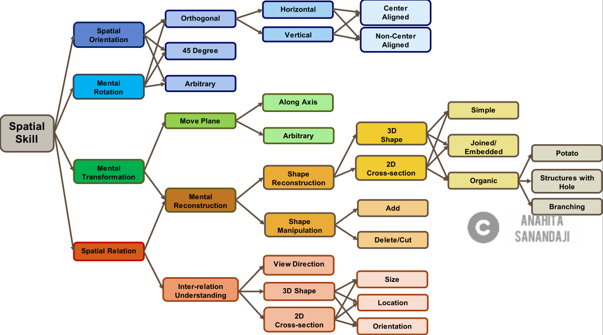
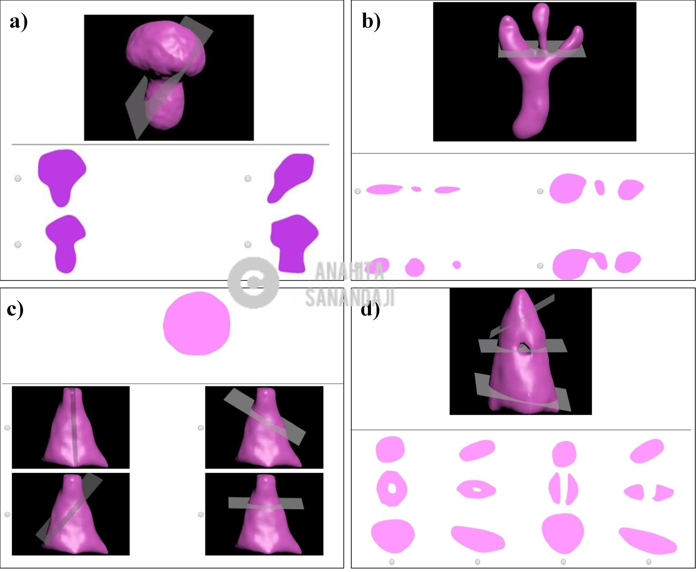

An Interactive Training Game to Enhance 3D Spatial Skills
=========
##Project Summery
 
####**Objective:** 
Developing and validating a novel domain-agnostic, computer-based training game for enhancing 2D cross-section understanding of complex 3D structures.
 
####**Why this game is needed:**
Understanding 2D cross-sections of 3D structures is a crucial skill in many disciplines, from geology to medical imaging. It requires a complex set of spatial/visualization skills including mental rotation, spatial structure understanding, and viewpoint projection. This game helps novices and people with lower spatial skills to independently understand and identify 2D cross-sections of 3D structures.

 

####**Application:**
- This game can be beneficial in different fields such as medical imaging, biology, geology, and engineering. 
- An application of our tool is in medical/research labs to train novice segmenters in ongoing manual 3D volume segmentation tasks. The use of the training game for medical imaging is potentially more beneficial for medical practitioners that exist outside of the ‘bleeding edge’ of technological adoption, for example in rural areas, more impoverished health care systems, and even in areas of the developing world.
- It can also be adapted in other contexts, such as training children, older adults, and individuals with very low spatial skills. 
 

####**Design & Implementation:**
This game is goal oriented. I designed the actual interface of the training game using a participatory design methodology in three phases: 

1. Low-fidelity Paper prototype (paper sketches and drawings) 
2. Higher-fidelity prototype (using balsamiq)
3. User interface implementation in Unity (writing C# scripts)

 

####**Evaluation:**
I conducted controlled studies with 60 participants to evaluate the training game. Study results show that the training game is effective for increasing different spatial skills, particularly 2D cross-section inference skills for a variety of 3D structures, from simple primitive ones to more complex biological structures, utilizing only a small window of training.
 

####**Technology used:** 
I used Unity/C# for developing the training game. I created 3D models using 3D Studio Max and ZBrush.
 

##Resources
**Note: Check my project (including a demo file) on GitHub: [Download from GitHub](https://github.com/AnahitaS/3DTrainingTool)**
You can download the file and run it on your system to play with the game. Make sure to check ReadMe.txt file first. Enjoy!

**Note: Check a video demo of my game: [Game Demo Video](https://youtu.be/ZDS2W_V0pyA)**
 In this video, I show some of the levels of the training game along with different features of the tool.

**Note: Here is the link to my [paper preprint](https://arxiv.org/pdf/2001.06737)**
This work has been published in [Human Factors](https://journals.sagepub.com/doi/abs/10.1177/00187208211018110): The Journal of the Human Factors and Ergonomics Society (a top-tier journal).

Process
-------
Throughout this project, I ensured the design & implementation process was as user-centered as possible. This was a very long and complex project with lots of background research; here’s a very high-level overview of what the project process looked like.

In the below sections I will focus on “Task design” for the Game, the “UI design”, and “Game evaluation”.

Training Game Task Design
-------
This game consists of a sequence of tasks with increasing levels of spatial difficulty. Each task requires the participant to move and/or orient the cross-section plane in order to achieve a specific goal, which is described verbally (e.g., position the plane so it creates a cross-section across the thinnest part of the object). Participants can interactively move the plane, change the viewpoint, show the current cross-section, request help, and receive feedback on the task.

- I designed the game training tasks to be goal-oriented and focused on the skills needed to understand the relationship between cross-section creating and viewpoint direction, slicing plane orientation, and 3D structure.
- Designing the tasks was an iterative process and I developed many design alternatives, and in the end selected the most concise set that covered the desired skills.
- To choose the tasks, I began by defining a set of canonical shape types based on ones seen in the observational studies and unique, identifiable cross-sections that arise from those shapes. Our game has 6 tasks in three levels.
- I created the final 3D models using 3D Studio Max, and ZBrush.

Training Game UI Design and Implmentaion
-------

This game has a 3D, interactive user interface (UI). I designed the actual interface using a participatory design methodology with five participants and in three phases: 

1. Low-fidelity Paper prototype.
2. Higher-fidelity prototype in Balsamiq.
3. User interface implementation in Unity.

For each design phase I asked participants to perform one or more of the tasks and provide me with their feedback. I successfully elicited major suggestions for usability refinements, such as the appearance of the main window, visibility and consistency of buttons, more representative buttons to support affordance (e.g., curved arrows for rotation), more visible feedback and help options, and removing interface elements that were not used in a specific task.

####**Task UI**
Each task has two UI modes implemented on separate pages: “Play” and “Solution”. On the “Play” page, participants complete a given task. Upon completion, participants hit the “Complete Task” button and are redirected to the “Solution” page where they can hit the “Show Answer” button and see the step-by-step correct answer for the task.

**The UI has three separate panels:**
 
1. Header panel: which has the level and task title along with a progress status image.
2. Main panel: which has the 3D model along with the buttons and sliders to move/rotate the plane, change viewpoint, and see cross-section changes. 
3. Help and answer panel: which provides help options (in the “Play” mode) and shows answers (in the “Solution” mode). 

**Other UI Elements:**
1. Viewpoint Visualization
2. Plane Movement and Rotation
3. Showing Cross-section from the Cut-away
4. Help Button and Feedback
5. Action Logging and Task Evaluation

Training Game Evaluation
-------
My primary effectiveness evaluation was based on pre- and post-spatial evaluations that measured both 3D cross-section abilities and specific spatial skills (viewpoint, mental rotation, card rotation).

The experiment session was conducted in groups of up to five participants at a time. We assigned each participant to the first available experiment session that met their time constraints and then randomly assigned each session to either the control or treatment. A total of 30 participants were randomly assigned to the control (Game) and 30 participants took part in the treatment (Training) group. Each study session consisted of three parts: pre-test, main training or game, and post-test.
 

####**Spatial Ability Performance Measures and Tests**
I used the following four tests to measure spatial ability performance of the participants before and after the training. Three of the tests are standard spatial skill measures (3D rotation, viewpoint, and 2D rotation), while the fourth is a modified version of a standard cross-section skill test:

1. *Mental Rotation Performance:* online version (implemented in Qualtrics) of the redrawn Vandenberg and Kuse (1978) Mental Rotations Test (MRT) by Peters et al. (1995).
2. *Viewpoint Visualization Performance:* I used a modified version of Guay’s Visualization of Views Test (Eliot & Smith, 1983).
2. *Card Rotations (S-1):* This test is used to evaluate 2D spatial relation performance  (French et al., 1963). 
4. *2D Cross-section Understanding Performance:* This test specifically measures cross-section understanding (Sanandaji, 2018) and therefore I used it as the main measurement. There are three question categories: 
	* Category 1: Given a 3D structure and slicing plane, identify the correct 2D cross-section contour.
	* Category 2: Given a 2D cross-section for a 3D structure, identify the slicing plane that generated the contour.
	* Category 3: Given a 3D structure and multiple slicing planes, identify the valid contour sequence that corresponds to the slices.

 

####**Results**
Results from statistical analysis showed significant performance gains on inferring 2D cross-section for participants of the training group ho used the game. Study results also indicate that the training tool is effective in improving two other spatial skills: mental rotation and viewpoint visualization. In addition, it produced a verifiable effect across those skills, utilizing only a small window of training. 

**Note:** For more on results of the evaluation please check my [paper](https://arxiv.org/pdf/2001.06737) (Published in in Human Factors: The Journal of the Human Factors and Ergonomics Society)

Outcome
-------
This game can be adapted to the training different contexts, such as novice medical image segmenters, engineering students, children, older adults, and individuals with very low spatial skills.
An application of our tool is in medical/research labs to train novice segmenters in ongoing manual 3D volume segmentation tasks. The use of the training game for medical imaging is potentially more beneficial for medical practitioners that exist outside of the ‘bleeding edge’ of technological adoption, for example in rural areas, more impoverished health care systems, and even in areas of the developing world.