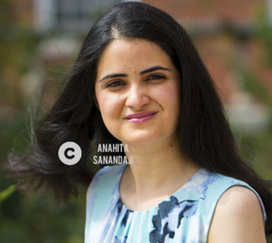

Anahita Sanandaji
=========

Self-motivated, goal driven User Experience (UX) Researcher with excellent analytical, organizational, and communication skills. 

I have a PhD in Computer Science, Human-Computer Interaction (HCI) from Oregon State University and have 8+ years of experience with qualitative and quantitative UX research methods including interviews, observations, think-aloud, usability testing, heuristic evaluation, survey design and implementation, sampling, data analysis, and statistics. Currently, I am a UX researcher at [Costar Group](https://www.costar.com/).

**[My GitHub](https://github.com/AnahitaS)**

