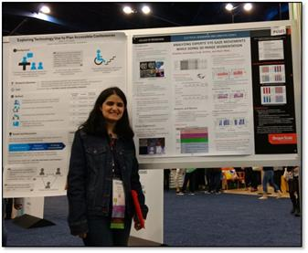

Anahita Sanandaji
=========

 
I am an Assistant Professor of Analytics and Information Systems at Ohio University. I received a PhD degree in computer science from Oregon State University in 2018. My research interests are Human Computer Interaction (HCI), data visualization and analytics, social computing, and User Experience (UX) research and design. As a researcher in the field of HCI, I focus on designing innovative user interfaces and technologies that improve human interaction with computers. My research methodology is a mix of theory, Human-Centered Design (HCD), implementation, and evaluation. I enjoy studying and analyzing how people interact with computing technologies and social spaces. 
I also have many years of teaching experience in both online and on-campus undergraduate and graduate level courses including statistics, software engineering, user experience design, programming, and information systems. In 2014, my service was recognized with Vice Provost’s Award for Excellence in Innovation, Online–teaching–Credit, EECS degree in computer science at Oregon State University.

 
<a href="ASanandaji_CV.pdf" title="Anahita's CV">My CV</a>
