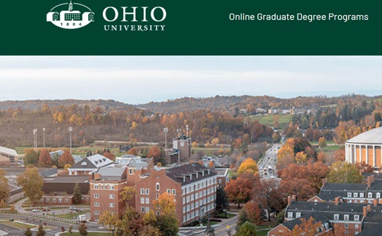

Other Projects
=========

User Experience and Market Research at Ohio University 
-------
**Note: This is an on going project.**

** My Role**:  I’m responsible for user experience research lead, market research/analysis, and people analytics for the [OU online MBA program](https://onlinemasters.ohio.edu/college-of-business/masters-business-administration/), one of the top OMBA programs in the nation. 

** Goal**: use different  research methods (both qualitative and quantitative) to:

- Increase student enrollments. 
- Enhance students’ satisfaction with current systems, applications, and tools we have (such as Learning Management Systems LMS)
- Provide better education opportunities specially during covid-19

** Process**

- Managing projects end to end by using different UX methods including interviews, and surveys with current students, faculty and even high school students. 
- Turning insights into practice: better website design and implementation to attract more prospective students. Bette design and implementation for LMS and educational tools.
- Report to stakeholders. Creating journey maps, personas. Design guidelines, prototypes.

Modeling Online Advertising Impact on Small Businesses
-------
**Note: This is an on going project.**

The main objective of this research is to gain an in-depth understanding of (1) how small businesses exploit online advertising during the COVID-19 outbreak, (2) how the customers react to online advertising strategies utilized by small businesses, and (3) how online advertising is expected to affect the resilience, recovery, and growth of small businesses during the COVID-19 outbreak. The findings from this research are expected to aid small businesses to develop online advertising strategies to improve their resilience and recover from the disruptions imposed by the pandemic. 

My proposed methodology consists of the two main following phases:

- **Phase 1.** Developing a conceptual model and conducting a formative study to build up our understanding of the customers of small businesses, their behavior, and how they are affected by online advertising prior to and during the pandemic. We will design and conduct surveys to verify the conceptual model, hypothesis, and find answer to the main research questions. 
- **Phase 2.** Develop a system dynamics simulation model based on the phase 1 findings and conceptual model to evaluate the effectiveness of online advertising on small businesses and its economic impacts on resilience, recovery, and growth of small businesses during and after the pandemic. 

The main goal of this research is to help small businesses use online advertising to gain resilience and growth during the pandemic. This proposal will benefit both the small businesses and online advertising platforms to withstand economic disruptions and speed up the recovery process. This research will also contribute to the broader goal of understanding the behavior and interactions of customers and small businesses during major economic disruptions. 

Visualizing Social Network Analysis (SNA) Metrics for Open Source Projects
-------
In this project, I designed and implemented an effective visualization to display SNA metrics for different open source projects during 18 months of forking period. The goal of the visualization was to help software developers and project managers observe and track the changes in metrics and trends during the forking period as part of their analysis for evaluating and predicting the open source project evolution.

Note: Feel free to see the <a href="index_visulization.html" title="Vis Project">project website</a>. The full description of the project can be found <a href="ASanandaji_Research_Statement.pdf" title="Vis Project">here</a>. 

 

Machine Learning and Intelligent Agents
-------
In this project, I designed an intelligent agent based on reinforcement learning to learn game strategies. The intelligent player was a modified version of the Line Runner game developed for Android and iOS. In my game, the agent learns to jump/roll to pass obstacles and collect coins to maximize the reward. I implemented the Intelligent agent in MATLAB and used Visual Basic for Applications (VBA) for visualizations, user interface, and animation.

Developing 3D Spatial Ability Test Instrument
-------
Results from our in-depth formative studies suggest that experts have a stronger mental model of the 3D structures they segment compared to novices. To validate this assumption, we introduce a novel test instrument to explore experts’ mental model in the context of 3D image segmentation. Our test instrcument is a more complex modified version of [Santa Barbara Solids Test (SBS)](https://labs.psych.ucsb.edu/hegarty/mary/publications/110).
We use this test instrument to measure individual differences in various spatial segmentation and visualization tasks. The tasks involve identifying valid 2D contours, slicing planes and 3D shapes.

 

Note: See [this video Tutorial](https://www.youtube.com/watch?v=S4RgqArzTI0) to get better understanding of 2D cross-section of 3D structures.