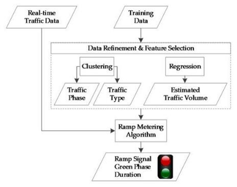
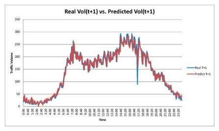
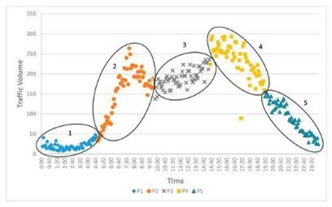

Intelligent Model for Traffic Flow Prediction
=========

In this project, I used machine learning techniques to develop a novel real time prediction model for ramp metering. I designed and developed a smart algorithm that utilizes historical traffic data, as well as traffic measures such as speed, current traffic volume, and breakdown capacity to control ramp signal based on the current and predicted traffic flow. I also was part of the team to create a simulation portal for the project based on UX concpets.

JavaScript Traffic Simulator
-------
This JavaScript traffic simulator is based on [movsim](https://github.com/movsim/traffic-simulation-de) open source JavaScript traffic simulator by [Arne Kesting](https://www.akesting.de/) and [Martin Treiber](https://mtreiber.de/).

Study
-------
We proposed [A Novel Ramp Metering Approach Based on Machine Learning and Historical Data](https://www.mdpi.com/2504-4990/2/4/21/xml) and published it in [Machine Learning and Knowledge Extraction](https://www.mdpi.com/journal/make) journal. The proposed ramp metering algorithm uses linear regression and real traffic data from a ramp in I-205 in Oregon State to predict the traffic flow during different hours of the day. We used K-means to determine traffic phase and type to set the ramp signal green phase.
We conducted a simulation study using this JavaScript Traffic Simulator to compare our proposed method with the traffic responsive ramp control method [ALINEA](http://onlinepubs.trb.org/Onlinepubs/trr/1991/1320/1320-008.pdf).

Contributions
-------
Following are the modifications and contributions we made in the traffic simulator

- The ramp and mainline traffic flows are read from a JSON input file located in the data folder
- ALINEA and proposed ramp metering algorithms are implemented in the Simulator
- Time setep (simulation time increments), start, and end time are added to the simulation
- [mljs](https://github.com/mljs/ml) is used for training and executing the proposed metering algorithm
- Metrics including traffic flow, downstream speed, green phase duration, ramp queue length, downstream occupancy, and ramp meter signal status are recorded during the Simulation
- All recorded metrics are visualized in interactive plots generated with [plotly.js](https://github.com/plotly/plotly.js/)
- Recorded metrics can be downloaded in CSV files for further analysis

Simulation Scenarios
-------
Three scenarios of no control, ALINEA ramp metering, and proposed ramp metering are provided below. Running the simulation with animation on is time consuming, so all three scenarios are limited to one hour (7:00-8:00AM) intervals with speed set to 150 frames per second. Running each scenario on a fast web browser (Google Chrome) and computer takes about 20 seconds.

* [No Ramp Control Scenario](https://saeedt.github.io/JSTrafficSimulator/index)
* [ALINEA Ramp Metering](https://saeedt.github.io/JSTrafficSimulator/index_alinea)
* [The Proposed Ramp Metering Method](https://saeedt.github.io/JSTrafficSimulator/index_proposed)

Demo Links
-------
Click on the scenario you would like to try!

* [No Ramp Control Scenario](https://saeedt.github.io/JSTrafficSimulator/index)
* [ALINEA Ramp Metering](https://saeedt.github.io/JSTrafficSimulator/index_alinea)
* [The Proposed Ramp Metering Method](https://saeedt.github.io/JSTrafficSimulator/index_proposed)

### More Information
For more information about the study and results check our open access publication [A Novel Ramp Metering Approach Based on Machine Learning and Historical Data](https://www.mdpi.com/2504-4990/2/4/21/xml).
