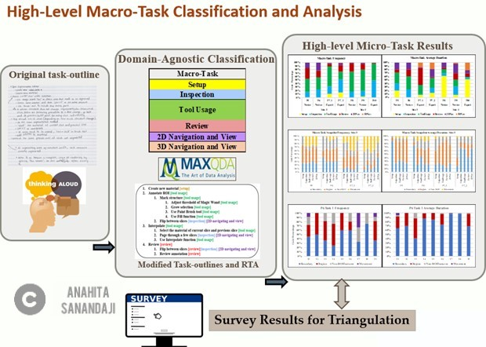

Analyzing Human Perception and Cognitive Tasks in 3D Image Segmentation
=========
##Project Summery
 
####**Challenge & Goal:** 
3D Image Segmentation is a fundamental process many scientific and medical applications such as locating tumors, measuring tissue volumes, and computer guided surgery. Performed (or evaluated) on 2D slices of the 3D data (stack of CT Scans).

While there are different automatic tools/algorithms for segmentation, **manual segmentation** is still serves as the gold standard and is done by experts with many years of experience. There are many situations where automatic algorithms simply fail. Manual segmentation time-intensive and non-trivial. Low image resolution and noise make unclear boundaries of biological tissues which are spatially and topologically complex 3D structures.

**So the question is how we can improve this important process?**.  Existing tools do not take into account: Low-level perception and cognition tasks, and segmenters’ mental models. In this work, as a UX researcher I was responsible for investigating 3D volume segmentation as a human-computer interaction/ User Experience paradigm. My main goal was to remove segmentation as a bottleneck to discovery and make the whole process more efficient, accurate and repeatable through developing better tools to be used by novice segmenters. 

 
####**Process, Results and Application:**
For this project, I started by conducing formative studies (using many different methods such as field interviews, observations, eye-tracking, surveys) which let to in depth data analysis and insights. Based on the insights, our team developed a comprehensive segmentation tool targeting novice users. I also used the insights from this work to develop a test measurement and training game from 3D cross-section understanding. 

The insights, guidelines, and tools that we have developed can be used in different fields that require image segmentation, particularly for training novice segmenters.

Team and My Role
-------

This has been a collaborative and comprehensive project along with my colleagues. A team of more than 30 undergraduate, graduate students, professors, experts, radiologists and biologists from different organization and universities were involved in this project. I was the Lead UX researcher of the team, managing all members, conducting the studies, analyzing data and sharing the insights with the team. I was also part of the segmentation tool team and heavily worked on the design of the tool, and was involved in actually implementing the tool by writing the code (mostly in C++). My work was supported by NSF awards IIS 1302142 and IIS 1302248.

##Resources
**Note: Check the project on [VolumeViewer Page.](https://volumeviewer.cse.wustl.edu/VolumeViewer/Home.html)**
VolumeViewer is an interactive tool for constructing surfaces from volume data, and has been developed based on the insights we obtained from this work.

**Note: Check my [3D Spatial Ability Test Instrument Demo.](Demo.htm)**
With this tool, I measure 3D spatial skills required for inferring 2D cross-section. Feel free to check this [Video Tutorial](https://youtu.be/FU06dgsFwIE) as well.

**Note: Papers**
This porject has led to different publications and talks. Check out a few of them:
- [Guided structure-aligned segmentation of volumetric data](https://link.springer.com/chapter/10.1007/978-3-319-27857-5_28) --*Best Paper Award*
- [Where do experts look while doing 3D image segmentation](https://dl.acm.org/doi/abs/10.1145/2857491.2857538)
- [Eliciting tacit expertise in 3d volume segmentation](https://dl.acm.org/doi/abs/10.1145/2968220.2968235)
- [Inferring cross-sections of 3D objects: a 3D spatial ability test instrument for 3D volume segmentation](https://dl.acm.org/doi/abs/10.1145/3119881.3119888)
- [How experts' mental model affects 3D image segmentation](https://dl.acm.org/doi/abs/10.1145/2931002.2948718)
- [Analyzing 3D Volume Segmentation by Low-level Perceptual Cues, High-level Cognitive Tasks, and Decision-making Processes](https://arxiv.org/ftp/arxiv/papers/2004/2004.02989.pdf)

**Note: Videos**
- In [this video](https://www.youtube.com/watch?v=u_V85f6edp8) I descirbe my research at OSU Graduate Expo 2016.
- See [this video Tutorial](https://www.youtube.com/watch?v=S4RgqArzTI0) to get better understanding of 2D cross-section of 3D structures.

 
Process
-------
I conducted this research in three main steps: 

- **Phase 1)** In this phase, I designed a novel hybrid protocol to conduct formative studies and fetch in-depth data from our participants doing real image segmentation in the field.
- **Phase 2)** Using the in-depth data from Phase 1, I performed various qualitative and quantitative data analysis to obtain insights on 3D image segmentation process.
- **Phase 3)** Based on the insights of Phase 2, I expanded our novel segmentation tool named VolumeViewer. Another tool I developed is a test instrument to measure 3D spatial skills required for inferring 2D cross-sections. I also introduced guidelines and training pedagogies that I used later in another project to develop a training game for novices.
In next sections I will focus on the details of each of the three phases.

 
Phase 1: Formative Study Design
-------
The aim of Phase 1 was to understand the segmentation process in the context of experts/novices performing real tasks and get in-depth and per-user analysis in the field. I designed a hybrid protocol to extract tacit expert knowledge within the application domain of 3D volume segmentation. 

The hybrid protocol uniquely blended UX qualitative and quantitative methods such as: Observation, Eye-tracking, Task analysis, Think-aloud, Interviews, Surveys

We recruited 20 participants (expert and novice segmenter) from 5 different sites who covered a range of tasks, data sets, tools, and expertise. We fetch a lot of raw data from different source that were used for data analysis in phase 2.

 

Phase 2: Data Analysis and Results
-------
In this phase I used the data (qualitative and quantitive) from Phase 1 to identifed and classified segmenters’ eye-gaze location, low-level perceptual actions, higher-level cognitive tasks and behaviors.

 
####**Use of Eye tracking and analysis eye gaze data:** 
This was very challenging particularly because the eye gaze data needed to be preprocessed. I converted raw eye-gaze data files to overlays and heatmaps and used Heatmap/gaze overlays to determine segmenters’ gaze location and mapped them to data Transcriptions.
 
####**Analysis**
Briefly my analysis consists of:

1. **Low-level Micro Task Coding Scheme and Analysis:** I analyzed and classified participants’ micro-tasks including perceptual cues, low-level actions (e.g. drawing) and tasks (e.g. marking vs. low-level reviewing).
2. **High-Level Macro-Task Classification and Analysis:** I identified what participants were doing during different stages of the segmentation process (from the segmenters’ perspective), and what were the domain-agnostic phases and patterns of higher-level actions during segmentation.
3. **Tool-feature/Data/Strategies Classification:** I identified what expert and novice segmenters state about the tool/data they work with and the strategies they employ during segmentation.

####**Results and Insights**

Here are the key insights we obtained:

- Different participants had different task-outlines and gaze patterns even if they worked with similar tools and data sets.
- Segmenter have two main segmentation strategies: 
  * Region-based: Seeing data as regions to be filled/marked
  * Boundary-based: Seeing data as boundaries to be demarcated by drawing contours
- Comparing to novices, experts have better knowledge of 3D structures and 2D cross-sections: 
  * In surveys more than 90% of experts mentioned they are very confident about 3D structures and cross-sections. For novices it was below 45%.  
- Experts tend to use 3D views more frequently / spend more time on 3D views.

Phase 3: Tools and Trainings
-------
In phase three, we put what we learnt into practice to develop tools and approaches to train novices to work with the 3D structures and views. The two main tools we developed are VolumeViewer and a test instrument to measure 3D spatial skills required for inferring 2D cross-sections.

####**VolumeViewer**
[VolumeViewer ](https://volumeviewer.cse.wustl.edu/VolumeViewer/Home.html) is developed to be used for 3D image segmentation while focusing on training novices to work with the 3D structures and views. It has been implemented using the Open Graphics Library (OpenGL). In the design of the interface, we included main window, 3D View, and training Guideline and step-by-step instructions.

We conducted controlled studies to evaluate this tool. Evaluation results of experts vs novices shows the VolumeViewer is effective and accurate for 3D image segmentation

####**3D Spatial Ability Test Instrument **
Based on the insight that experts have better knowledge of 3D structures and 2D cross-sections, I developed a 3D Spatial Ability Test Instrument for Inferring 2D cross-sections. Feel free to checkout a [Demo of this tool](Demo.htm)

This tool is a multiple-choice measure that captures skill sets and range of difficulty, focuses on organic 3D structures, rotation/animation instead of static images.  It has three categories of questions:

1.	Given a 3D structure and slicing plane, identify the correct 2D cross section contour.
2.	Given a 3D structure and 2D cross section contour, identify the correct slicing plane that corresponds to the contours.
3.	Given a 3D structure and multiple slicing planes, Identify the valid contour sequence that corresponds to the slices.

I tested and validated this tool on more than 150 participants. I later used this test for evaluating my novel training game.

Outcome
-------
The outcome of this user experience and interface development research is tools and trainings that enable experts and the general public to collaborate in the identification and segmentation of structures within time-varying volumetric data.