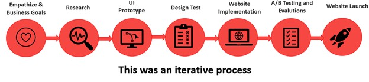

Building a Better systemgroup.net Portal Through UX Practices
=========
##Project Summery
 
####**Context:** 
- [SystemGroup Company](https://www.systemgroup.net/) (largest software engineering company in my Home Country) wanted to convert its main portal website into a modern, responsive, and accessible platform with better conversion rate, better branding, and better marketing opportunities. The website was needed to support two languages: English and Farsi.

- At the time, before I joined Systemgroup, there was no central UX team at the company. I managed the whole UX process.

- **Prior Website:** The prior site was functional, but was not responsive or accessible, did not represent the brand, and was only in Farsi.

 
####**Goals**
- Modernize the user experience of the website while supporting two languages: English and Farsi.
- Make the site and navigation responsive and improve info discovery.
- Improve conversion rate, and overall customer experience.
- **My aim for the UX team:** Develop Systemgroup’s UX practice & establish User experience research culture in the organization.

 
####**My Role**
**UX Researcher:** I was responsible for Systemgroup’s overall online UX experience. I established the team for this project, ran the project based on UX research best practices, collaborated with the design, development, support and manger teams, and led all stakeholder reviews.

Process
-------
- The process started with understanding the business goals and objectives for the project. 
- Then, I began the UX research to the redesign work. This included running a survey of what major features/pages the site contained. I also worked with the designers/developers, and we conduced  in-depth research (competitive research, web analytics, interviews, usability studies, card sorts).
- We then created personas, user journeys, low- and mid-fidelity concepts for user flows, navigation, and page layouts. We also evaluate our designs through usability testing.
- We implemented the design by creating our main website interface. But design isn't complete until the data says it meets business goals, so I ran A/B testing to evaluate the new experience against the existing one. During A/B testing of the experience, I reviewed the data from a UX perspective, and hypothesize and propose user experience/design solutions to issues that were revealed.
- Eventually the website was polished enough to move beyond testing and into the real world.

 Outcome
-------
The design was successfully launched. As a result of several optimization efforts through A/B testing the site saw a 4.1% conversion rate increase. It supported two languages: English and Farsi. It was also accessible for people with visual/motor impairments and responsive for mobile and tablet browsers.

**Feedback** to the redesign both from customers and internal employees) was extremely positive. 

