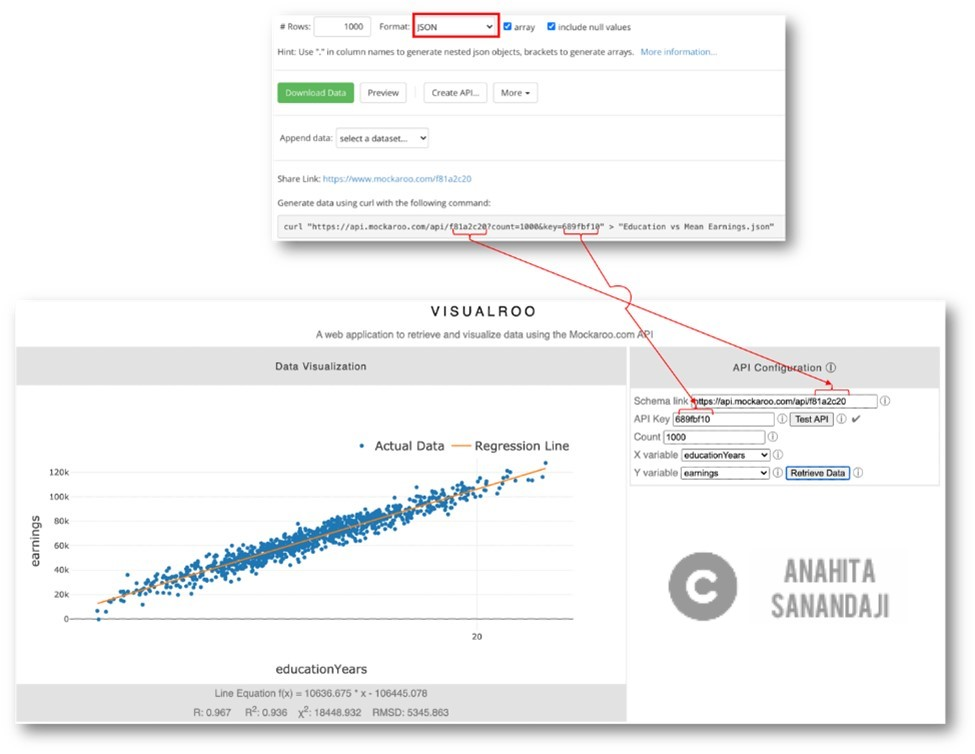
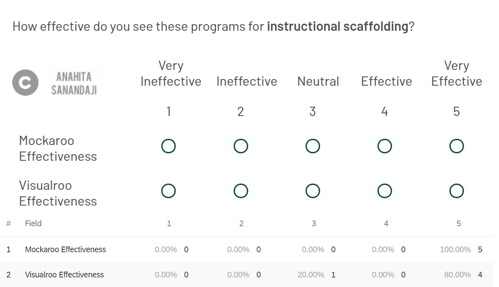

Visualroo: A Web Application to Retrieve and Visualize Data
=========
##Project Summery
 
####**Challenge & Goal:** 
Professors often have a particular problem in mind that they would like to demonstrate. Finding a dataset that fits the problem and visualizing it is challenging. In this collaborative work I and my team work on creating synthetic datasets that match the characteristics of a real world problem and then visualize those datasets.

Interesting analytics examples often appear in the popular press, such as the relationship between years of education and income. Usually the data has been summarized which makes it useless for an analytics exercise. Our strategy is to reverse engineer from the summary data to create a realistic dataset for students to analyze and then visualize the data.

In this project, we created "Visualroo" a client side web application developed in JavaScript used for teaching regression and statistical dependence (correlation). It connects to a [Mockaroo](https://www.mockaroo.com/) schema using an API key. We feature Mockaroo since it is cloud based, free, intuitive, customizable, and rich in data types. Furthermore, the Mockaroo API allows us to expand our real time visualization tool. Two variables from the schema can be selected and visualized. Visualroo uses [mljs](https://github.com/mljs/ml) simple linear regression to find the equation for the fitted line and visualizes the results using [plotly.js](https://github.com/plotly/plotly.js/). 

 
####**Application:**
- Ability to customize problems by educators to meet their pedagogical goals
- Peserving a sense of realism and scale in the datase 
- Bringing the data to life to further its explanation

By making this tool open source we are inviting the academic community to develop similar tools for other types of analytics problems. The ml.js library used in Visualroo includes a variety of regression models such as polynomial, power, exponential, decision tree, random forest and robust regression as well as other supervised and unsupervised learning methods such as artificial neural networks (ANN) and K-means.
 

####**Team**
This is a collaborative project along with my colleagues [Dr. Raymond Frost](https://business.ohio.edu/about/faculty-staff/frost-raymond/) and Dr. Saeed Ghanbartehrani. I was responsible for the UX research and interface design and implementation. 
 

##Resources
**Note: Check the project on [GitHub](https://github.com/AnahitaS/MockAPI)**

**Note: [Demo Page](https://visualroo.my.to/)**

**Note: I and Dr. Frost presented this tool in SIGDSA 2020. Check out our [presentation videos.](https://www.youtube.com/playlist?list=PL_Xj46UzktxPX4iVq54W5Cf6AXYx9TJR4)**

 
Process
-------
For this project, I ensured the design & implementation process was as user-centered (focusing on students and educators) as possible. Here’s a very high-level overview of what the project process looked like.

In the below sections I will focus on the research, tool design, implementaion and evaluationtion.

 
Research
-------
 
####**Field Interviews with Students and Faculty**
Initially, to define the scope of the problem, I conducted some field interviews with both students and faculty. My goal was to better understand the problem from their perspective. Each interview session was lasted less than 30 minutes in the field (classroom). The type of the interview was semi-structured. Here is the list of some of the questions I asked:

- How do you create/use datasets for your classes?
- What visualization tools have you worked with? 
- Name some of the challenges you have had working with those tools.
- Assume, you have a tool that helps you create synthetic data that is very similar to real world data What do you think about this tool? 
- Assume, you have a tool that pull the data form another source (a website) automatically, and instantly visual the data (e.g., scatter plot of regression). What do you think about this tool? 

 

####**Literature Review & Inspiration**
I also did an extensive literature review to find inspirational examples/tools to both create synthetic data and do instant visualization of that data. Much prior research on synthetic data creation has focused on creating large datasets for system testing. Some have focused on database benchmarking or SQL testing. There are also a number of server-side data visualization tools. These tools require a web server running special software as well as configuration and maintenance. Therefore, it is of interest to design and develop a tool that retrieves data in real time and eliminates the need to download, store, and manually import data files. 
 

####**Key Insights**
Some of the insights I obtained from research phase are:

- Students appreciate using a visualization tool (e.g., in their statistics classes) that does not require any software or installation.
- Educators appreciate using a visualization tool (e.g., in their statistics classes) that helps them create descent visualization in real time without a need to use complicated software or to export/import data.
- Use of such a tool will be efficient for students in terms of decreasing the learning curve.
- Use of such a tool will be efficient for educators in terms of removing the necessity for importing/exporting data every single time.

Visualroo Design, Implementaion & Evaluation
-------
 
####**Design**
We designed our open-source visualization tool (Visualroo) to provide real time visualizations of Mockaroo datasets. To design the UI interface, I started by sketching low fidelity of the application. I continuously checked the design with the team and some volunteer students and faculty to make sure it has all the features that is needed. The high-fidelity prototype and also the final interface were all created using HTML and JavaScript.

 
####**Implementaion**
Visualroo, plotly.js, and ml.js are all open-source libraries. This means that the system can be extended by the community to encompass other analytics examples. 

Visualroo works with any registered user's Mockaroo account. Begin by creating the schema in Mockaroo. Choose the option to format the data in JavaScript Object Notation (JSON) and save the schema. Start [Visualroo](http://visualroo.my.to/.) Then copy the schema link and API key to Visualroo, click the test API button, choose x and y variables, and click the Retrieve Data button. As the user hovers over data points, the actual values are automatically highlighted. The tool can also zoom and pan over the data. The tool is menu driven and user friendly.

Visualroo is particularly effective in showing the effect of relative changes in the X, Y, and Error terms. Each change can be captured using the screen shot option. The screen shots can then be placed side by side in order to demonstrate a concept—such as the effect of changes in the standard deviation of the error term on the R squared. Such demonstrations can aid in student understanding.

 
####**Evaluation Results**
We conducted an evaluation survey (with more than 100 students, faculty and experts) to check the effectiveness of the tool. More than 85% of students were found the tool to be effective in their learning some statistic topics such as linear regression. More than 80% of the faculty and expert indicate that using the tool is beneficial to be used in the classroom. More than 75% of them indicate their willingness to use the tools in their classes.

 

Outcome
-------
Synthetic data creation offers faculty the ability to customize problems that meet their pedagogical needs while preserving a sense of realism and scale in the dataset. Faculty can reverse engineer datasets that match interesting issues appearing in the news. For this to be useful, the process has to be relatively easy. 

Mockaroo makes it easy to create synthetic datasets. Visualroo, which is code free and open source, brings the data to life to further its explanation. By making this tool open source we are inviting the academic community to develop similar tools for other types of analytics problems.
