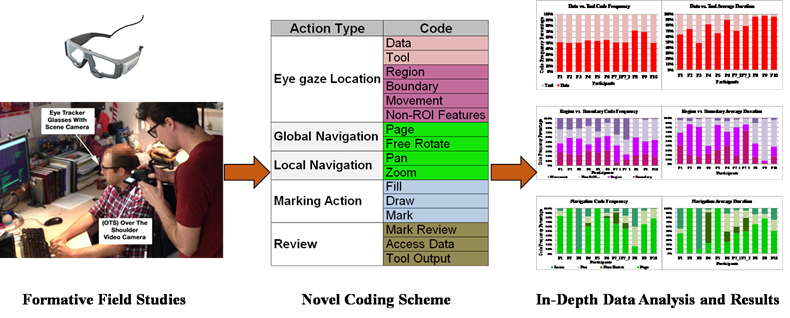
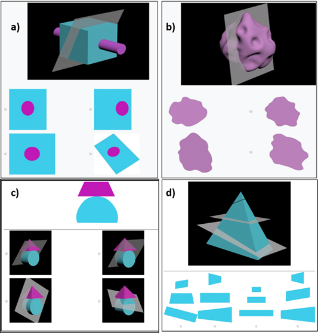
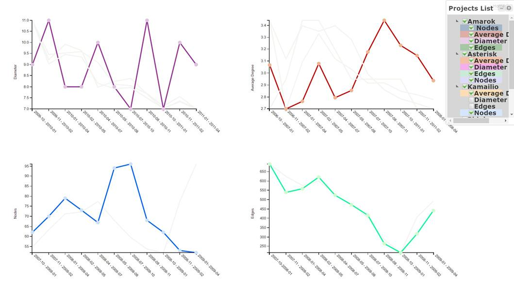
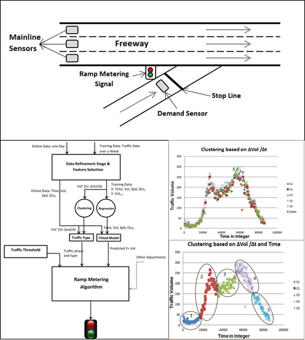
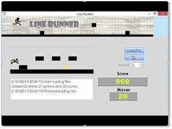

Projects
=========
Understanding the Manual 3D Image Segmentation Process
-------
I have had the opportunity to be part of an on-going NSF-funded research with collaborators at the University of North Texas and Washington University in St. Louis. This project focuses on understanding the cognitive and perceptual basis of how experts extract 3D shapes from volumetric data, (e.g., MRI or CT imaging). This process, known as “3D image segmentation” is a fundamental step in many scientific and biomedical applications such as locating tumors. 
My role in this research is to understand human factors involved in segmentation process to make the process more efficient and accurate. In our studies, we designed a novel hybrid protocol that blends observation, interviews, surveys, and eye-tracking, to capture in-depth data. We then developed and validated data coding schemes which could successfully discern segmenters’ low-level perceptual actions, higher-level cognitive tasks, and different segmentation strategies utilized by expert versus novice segmenters to analyze the data captured.

In [this video](https://www.youtube.com/watch?v=u_V85f6edp8) I descirbe my research at OSU Graduate Expo 2016.

 

Note: The project website is accessible at: [VolumeViewer Page](http://volumeviewer.cse.wustl.edu/VolumeViewer/Home.html)

Developing 3D Spatial Ability Test Instrument
-------
Results from our in-depth formative studies suggest that experts have a stronger mental model of the 3D structures they segment compared to novices. To validate this assumption, we introduce a novel test instrument to explore experts’ mental model in the context of 3D image segmentation. Our test instrcument is a more complex modified version of [Santa Barbara Solids Test (SBS)](https://labs.psych.ucsb.edu/hegarty/mary/publications/110).
We use this test instrument to measure individual differences in various spatial segmentation and visualization tasks. The tasks involve identifying valid 2D contours, slicing planes and 3D shapes.

 

Note: See [this video Tutorial](https://www.youtube.com/watch?v=S4RgqArzTI0) to get better understanding of 2D cross-section of 3D structures.

Developing an Interactive Training Tool for Inferring 2D Cross-sections of 3D Structures
-------
The ultimate objective of our research is to develop a tool-agnostic training pedagogy to improve novice segmenters’ 3D spatial skills. We are developing a working prototype of a segmentation tool that help novice segmenters throughout a segmentation task by providing comprehensive instructions and guidelines on how to work with 3D views and structures. Training pedagogy development is still in progress and it will eventually help separating learning the tool set from learning how to segment.  complete by the end of Dec 2014. Since the prior version of the TNA tool developed in phase one could no longer accommodate the new project requirements, in this phase a new Transit Network Analysis tool is developed from scratch using open source development tools and platforms. 

Click here to see some of our low-fidelty design and sketches

Visualizing Social Network Analysis (SNA) Metrics for Open Source Projects
-------
In this project, I designed and implemented an effective visualization to display SNA metrics for different open source projects during 18 months of forking period. The goal of the visualization was to help software developers and project managers observe and track the changes in metrics and trends during the forking period as part of their analysis for evaluating and predicting the open source project evolution.

Note: Feel free to see the <a href="index_visulization.html" title="Vis Project">project website</a>. The full description of the project can be found <a href="ASanandaji_Research_Statement.pdf" title="Vis Project">here</a>. 

 

Intelligent Model for Traffic Flow Prediction
-------
In this project, I used machine learning techniques to develop a novel real time prediction model for ramp metering. I designed and developed a smart algorithm that utilizes historical traffic data, as well as traffic measures such as speed, current traffic volume, and breakdown capacity to control ramp signal based on the current and predicted traffic flow.

Machine Learning and Intelligent Agents
-------
In this class project, I designed an intelligent agent based on reinforcement learning to learn game strategies. The intelligent player was a modified version of the Line Runner game developed for Android and iOS. In my game, the agent learns to jump/roll to pass obstacles and collect coins to maximize the reward. I implemented the Intelligent agent in MATLAB and used Visual Basic for Applications (VBA) for visualizations, user interface, and animation.

