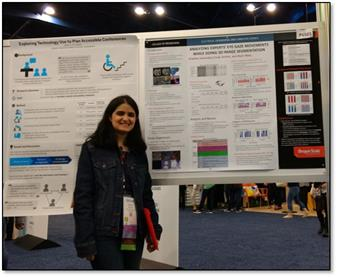

Anahita Sanandaji
=========

 I am a PhD candidate of computer science at Oregon State University where I work under supervision of [Dr. Cindy Grimm](http://mime.oregonstate.edu/people/grimm). My primary research area is Human-Computer Interaction (HCI). Additionally, software engineering and testing, information visualization, and computer networks are among my research interests. 

 As a researcher in the field of HCI, I focus on designing innovative user interfaces and technologies that improve human interaction with computers. My research methodology is a mix of theory, Human-Centered Design (HCD), implementation, and evaluation. 

 I also have many years of teaching experience both as a graduate teaching assistant and as an instructor. During Summer and Fall of 2013, as a user experience design instructor, I helped more than 200 post-baccalaureate students (with diverse background and ethnicities) learn user experience skills, to switch into CS careers. In 2014, my service was recognized with Vice Provost’s Award for Excellence in Innovation, Online–teaching–Credit, EECS degree in computer science.

 
<a href="ASanandaji_Resume.pdf" title="Anahita's Resume">My Resume</a>
